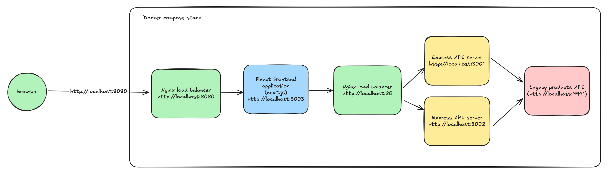

# Assetstore team | Fullstack Take-home assignment

This is the take home assignment for the fullstack position in the Assetstore team at Unity.

Please fork this repo, complete the assignment, and send us the link to the repo.

# Context

You have a frontend application, in NextJS/React, that is consuming an API designed with an Express server. Right now the API is returning some hardcoded data.

The current infrastructure has multiple instances of the backend with a load balancer to distribute the load.

# How to run this project on your computer

Note that the provided boilerplate assumes that you have Docker installed on your machine. If you do not have Docker installed yet please do so.

1. Fork the challenge boilerplate from https://github.com/andersblom/store-challenge to a public repository on your personal Github account
2. Clone your forked version of the repository onto your computer
3. From the root of the repository run `docker compose up` to start all of the services.

You are now ready to start building! The frontend application will start on `http://localhost:8080` and the backend application on `http://localhost:80`. If you run into any issues with running the setup try `docker compose up --build`.



# Instructions

We want you to replace the hardcoded data served by the Express API with some real data. The real data is going to come from a legacy system. A provided docker container called `legacy-api` will be that source of data. It’s available on port `9991` and will not / should not be load balanced. You don’t have access to the source code of this legacy api, and must treat it as a black box. The container will generate random products on startup. For testing purposes, product ID `46172` always exists. 

Once you integrate with the legacy API, you should modify the existing Express API and frontend code to display the product name & price in the product detail page.

The legacy API simulates a legacy system. The legacy service is susceptible to SQL injection and can't handle more than 5 requests per second. Make sure you consider this while building your code around it.

We expect the final application to be able to serve 10 requests per second.

You can modify the docker compose setup to add additional containers if need be. Note that if you add any services their images must be public or included in the source code.

Feel free to provide:
* A written explanation to explain the changes you did and how they were tested
* Some units or integration tests
* A writeup of any further improvements you would make to this application if you had more time

***We’re expecting the whole exercise to take no more than 3 hours.***

## The legacy API

This legacy API has 2 endpoints.

## Get all products

GET /api/products

Will return

```json
{
    "total": 2,
    "products": [
        {
            "id": "32277",
            "name": "Plexiglass Silver Fridge"
        },
        {
            "id": "35737",
            "name": "Fan Wave Carbon"
        }
    ]
}
```

## Get product price

GET /api/products/price?id=xxx

Will return 

```json
{
  "price": 368.72
}
```

# How your code will be evaluated

* We will check if your application is secure (see OWASP top 10)
* We will run a load test on your Express API to make sure it can handle 10 requests per second without errors
* We will test your frontend app to make sure we get the price for each product

For the number of requests per second, you can use something like [hey](https://github.com/rakyll/hey) to check against your service. Once installed, run 
```
hey -n 50 -c 1 -q 10 http://localhost/my-api
```
* "-n 50" means 50 requests total.
* "-c 1" means 1 worker
* "-q 10" means 10 requests per second per worker

If you add more worker, make sure to deduce the value of -q to account for that